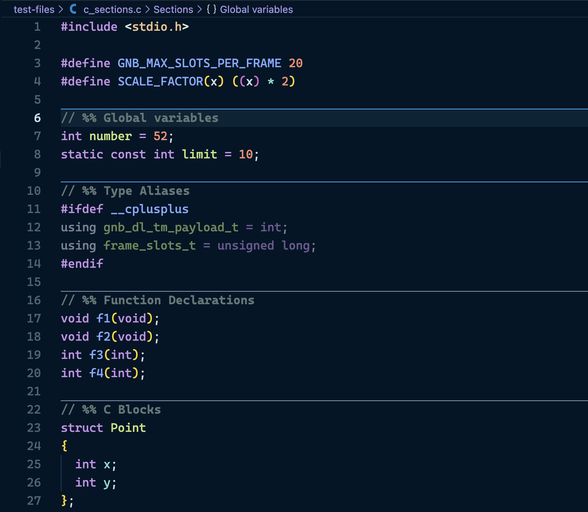
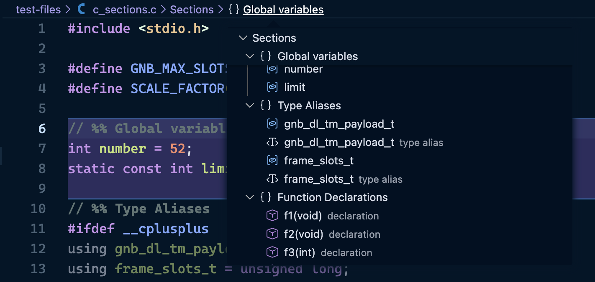
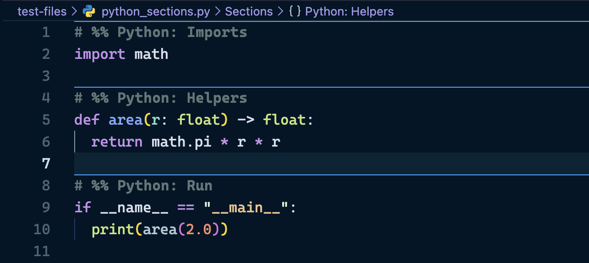
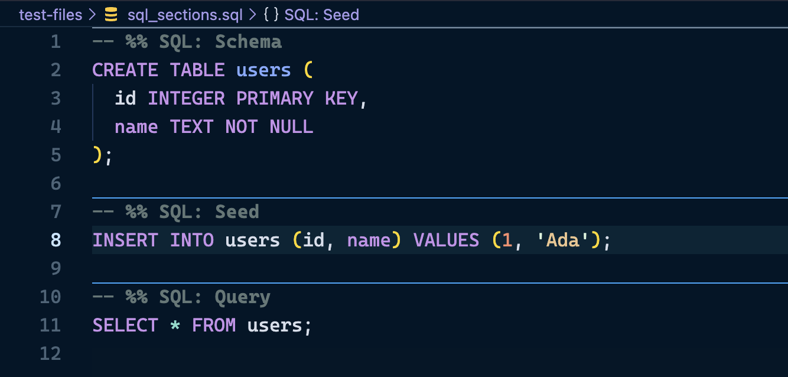
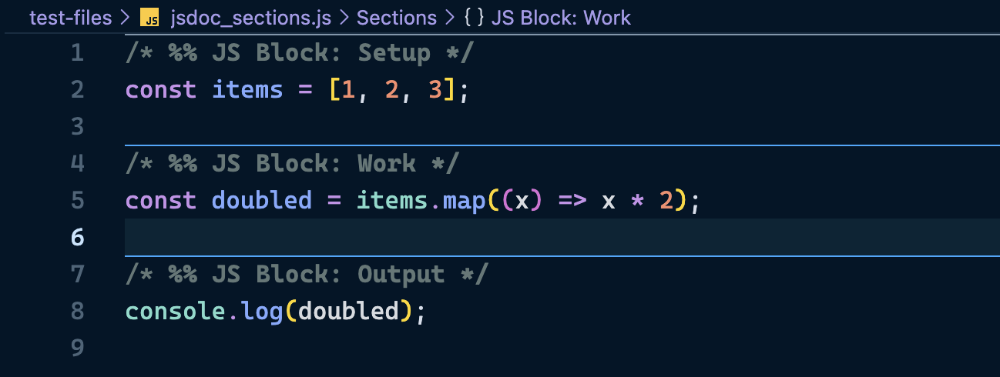
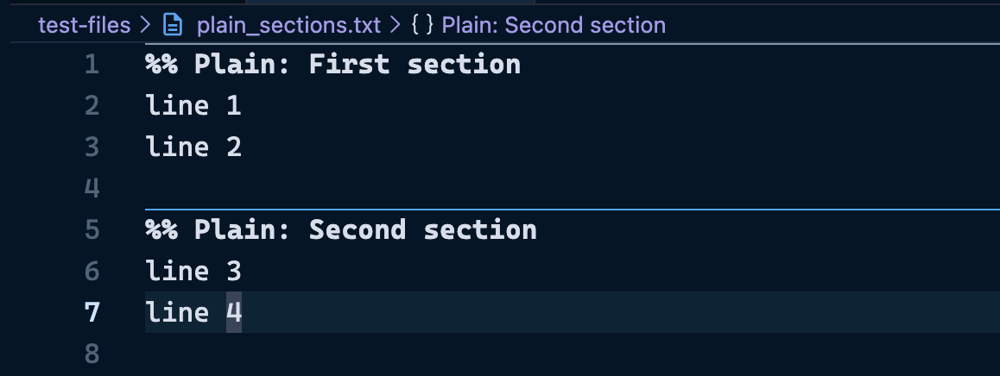

# MATLAB Style Sections (VS Code)

Provides MATLAB-like section headers using `%%` across many languages.

## Supported header styles

Any line that looks like a comment plus `%%` is treated as a section header, for example:

- `%% Section Title`
- `// %% Section Title`
- `# %% Section Title`
- `-- %% Section Title`
- `; %% Section Title`

## Features

- Renders a horizontal divider on section header lines across languages.
- Styles section header text (`%% ...`) with strong emphasis.
- Makes each section foldable with the fold chevron on the section header line.
- Exposes `%%` sections in Outline/Breadcrumbs so you can jump via editor symbols.
- Core section rendering works across languages (not tied to one parser).
- Automatically disables itself for `.m` files to avoid conflicts with MATLAB extensions.
- When your cursor is inside a section, only that section's divider lines are highlighted blue.
- Extensive container detection supported for:
- C/C++
- Verilog

## Settings

- `matlabSections.enabled` (default: `true`)
- `matlabSections.decorateHeader` (default: `true`)
- `matlabSections.showDivider` (default: `true`)
- `matlabSections.indentAware` (default: `true`)

## Showcase

### C/C++ Sections

### Hierarchy

### Verilog Sections

### Python Sections

### SQL Sections

### JavaScript Sections

### INI Sections

### Even Plain Text!

